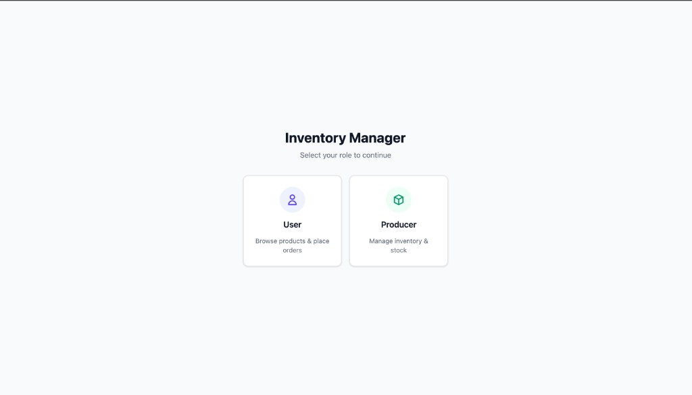
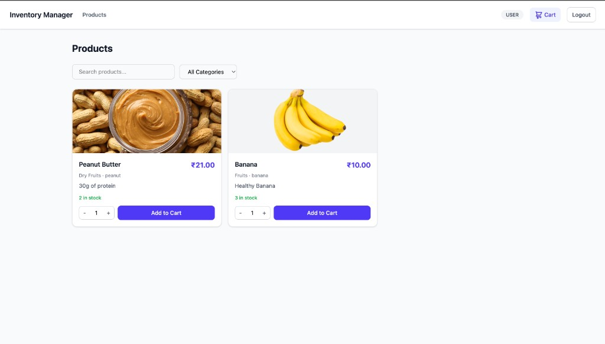
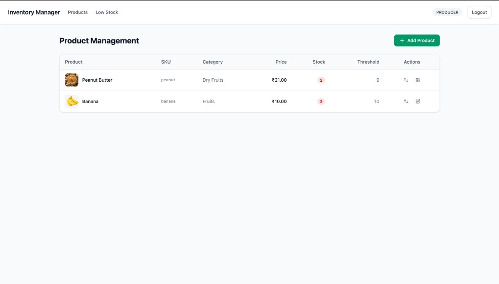
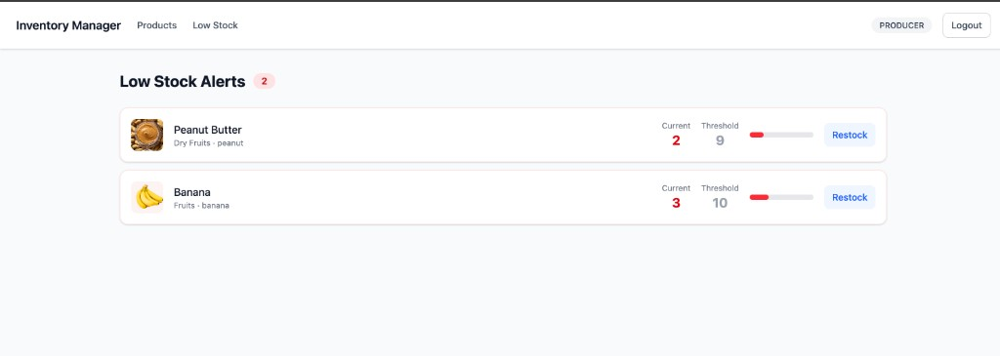

# Inventory Management System

A full-stack inventory management application with two roles — **Producer** (manage products and stock) and **User** (browse products and place orders).

## Screenshots

### Role Selection


### Product Listing (User View)


### Product Management (Producer View)


### Low Stock Alerts


---

## Setup & Run Instructions

### Prerequisites

- **Node.js** v18+
- **pnpm** (package manager)
- **MongoDB Atlas** cluster (or local MongoDB instance)

### Backend

```bash
cd backend

# Install dependencies
pnpm install

# Create .env file with the following variables
# PORT=4000
# MONGODB_URI=mongodb+srv://<user>:<password>@<cluster>.mongodb.net/inventory
# CORS_ORIGIN=http://localhost:5173

# Start development server
pnpm dev
```

The backend runs on `http://localhost:4000`.

### Frontend

```bash
cd frontend

# Install dependencies
pnpm install

# Create .env file with the following variable
# VITE_API_BASE_URL=http://localhost:4000/api

# Generate API hooks from OpenAPI spec
pnpm generate-api

# Start development server
pnpm dev
```

The frontend runs on `http://localhost:5173`.

---

## Technology Stack

| Layer     | Technology                                                  |
| --------- | ----------------------------------------------------------- |
| Frontend  | React 19, Vite, TypeScript, Tailwind CSS v4                 |
| State     | React Query (TanStack Query), Context API, localStorage     |
| API Layer | OpenAPI 3.0 spec, Orval (auto-generated React Query hooks)  |
| HTTP      | Axios                                                       |
| Routing   | React Router v7                                             |
| Backend   | Node.js, Express 5, TypeScript                              |
| Database  | MongoDB Atlas, Mongoose 9                                   |
| Validation| Zod                                                         |
| Dev Tools | tsx (watch mode), pnpm                                      |

---

## Assumptions Made During Development

1. **No Authentication** — Role selection (User/Producer) is handled via a simple toggle on the landing page. There is no login, signup, or JWT-based auth. Any user can switch roles freely.

2. **Role Persistence** — The selected role is stored in `localStorage` so it survives page refreshes, but there are no user accounts behind it.

3. **Cart is Local Only** — The shopping cart is managed entirely on the client side using `localStorage`. It is not backed by any server-side session or database collection.

4. **Product Images via URL** — Product images are provided as external URLs (not uploaded). No server-side image storage or validation of image links is implemented.

5. **Single Currency (INR)** — All prices are displayed in Indian Rupees (₹). No multi-currency support.

6. **Stock Prevention** — Negative stock is prevented both during manual stock adjustments (Producer) and during order placement (User). Order creation uses MongoDB transactions for atomic stock deduction.

7. **Order Cancellation Restocks** — When an order is cancelled, the stock for each product in that order is automatically restored.

8. **Low Stock Threshold** — Each product has a configurable `lowStockThreshold` field. Products where `quantity <= lowStockThreshold` appear in the Low Stock alerts page.

9. **No Pagination** — Product and order listings fetch all records at once. Pagination is not implemented, assuming a manageable dataset size for demo purposes.

10. **MongoDB Atlas** — The project assumes a cloud-hosted MongoDB Atlas cluster. IP whitelisting must be configured in Atlas for the connecting machine (locally: your IP, deployed: the server's IP or `0.0.0.0/0` for open access).

11. **CORS** — The backend explicitly whitelists the frontend origin (`http://localhost:5173`) to prevent cross-origin issues. This must be updated when deploying to a different domain.

12. **Frontend and Backend are Independent** — They are separate projects with their own `package.json`, not a monorepo. The OpenAPI spec in `frontend/openapi/spec.yaml` serves as the contract between them.
